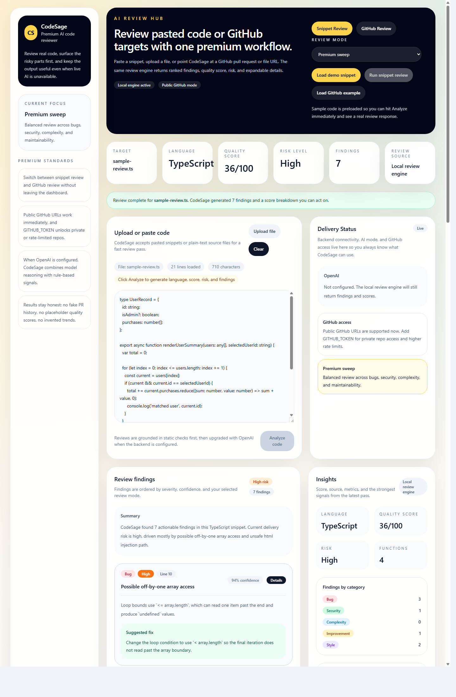
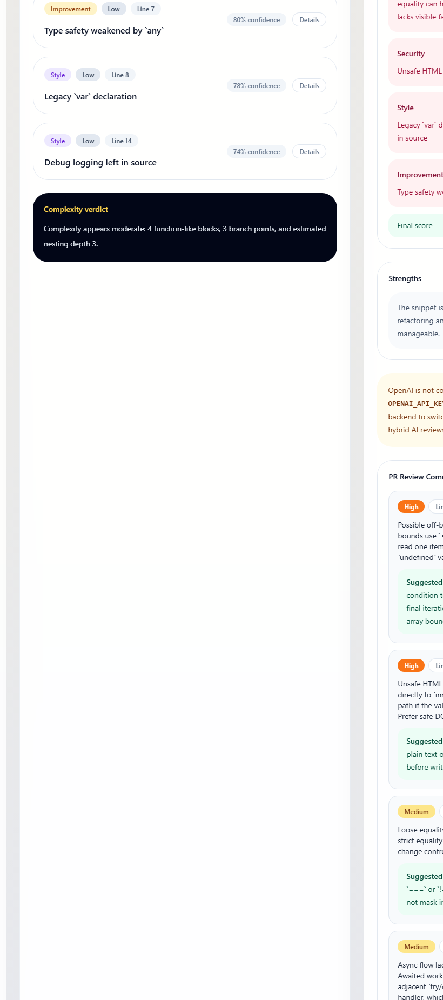
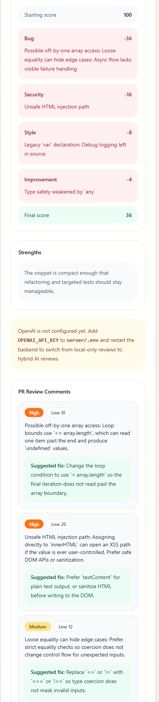
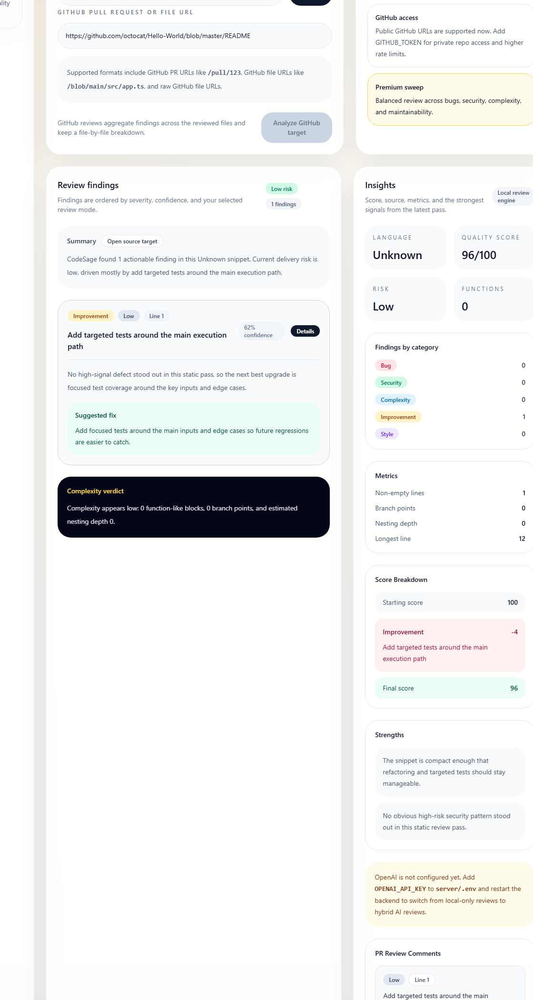

# CodeSage

CodeSage is a premium AI-powered code reviewer built with React, Vite, Express, and OpenAI. It helps teams review pasted snippets, uploaded files, GitHub files, and pull requests with transparent scoring, fix suggestions, and a polished review dashboard.

It works in two honest modes:

- `Local review engine`: deterministic checks for bugs, security smells, complexity, maintainability, and code quality.
- `OpenAI + local checks`: hybrid analysis when `OPENAI_API_KEY` is configured on the server.

## Live Demo

- Frontend: `https://codesage-frontend-one.vercel.app`
- Backend: `https://codesage-api-1mv8.onrender.com`
- Backend status: `https://codesage-api-1mv8.onrender.com/api/status`

## Deployed Status

- Frontend is live on Vercel
- Backend is live on Render
- Production snippet review is working end to end
- The current live deployment is running in local review mode until `OPENAI_API_KEY` is added

## Highlights

- Analyze pasted code or uploaded source files
- Review GitHub file URLs and pull request URLs
- Browse a GitHub repository and select open PRs inside the UI
- Show ranked findings with severity, confidence, line numbers, and expandable details
- Return fix suggestions, PR-style review comments, and before-vs-after code improvements
- Explain score impact with a visible breakdown instead of a mystery number
- Surface language detection, quality score, risk level, strengths, and code metrics
- Support focused review modes: full, security, quality, and performance

## Tech stack

- `frontend/`: React, TypeScript, Vite, Tailwind CSS
- `server/`: Express, TypeScript, OpenAI API

## Why it stands out

CodeSage is designed to feel closer to an assistant than a static analyzer. It does not just label issues. It explains them, suggests fixes, simulates GitHub-style review comments, and shows how the code could improve.

## What to Try

- Load the demo snippet and run a full review
- Inspect ranked findings, fix suggestions, and score breakdown
- Compare the before-vs-after fix preview
- Switch to GitHub review and analyze a public PR or file URL

## Screenshots

Live production screenshots:









## Local setup

1. Install dependencies:

```bash
npm install
```

2. Start the backend:

```bash
npm run dev --workspace server
```

3. Start the frontend:

```bash
npm run dev --workspace frontend
```

4. Open `http://localhost:5173`

## Environment variables

Create `server/.env` from `server/.env.example` if you want hybrid AI reviews:

```env
OPENAI_API_KEY=your-openai-api-key
OPENAI_MODEL=gpt-5.2
GITHUB_TOKEN=your-github-token
PORT=4000
```

Optional frontend override:

```env
VITE_API_BASE_URL=http://localhost:4000
```

Behavior notes:

- If `OPENAI_API_KEY` is missing, CodeSage still works using the built-in local review engine.
- If `GITHUB_TOKEN` is missing, public GitHub reviews still work, but private repositories and higher-rate API access will not.
- Never commit real keys. Keep secrets only in deployment environment variables.

## Verification

Run these checks from the repo root:

```bash
npx tsc --noEmit -p server/tsconfig.json
npx tsc --noEmit -p frontend/tsconfig.json
npm run build --workspace server
npm run build --workspace frontend
```

## Deployment

- Frontend: deploy `frontend/` to Vercel and set `VITE_API_BASE_URL`
- Backend: deploy `server/` to Render or Railway and set `OPENAI_API_KEY`
- Full launch steps: see `DEPLOYMENT.md`

## Public repo safety

- `.env` files, local env overrides, logs, keys, and local workspace state are gitignored
- `server/.env.example` contains placeholders only
- Secrets should live only in Vercel, Render, or Railway environment settings

## Roadmap

- GitHub authentication for private repository selection
- richer diff-aware fix generation
- team review history and saved sessions
- exportable review reports

## License

Released under the MIT License. See `LICENSE`.
